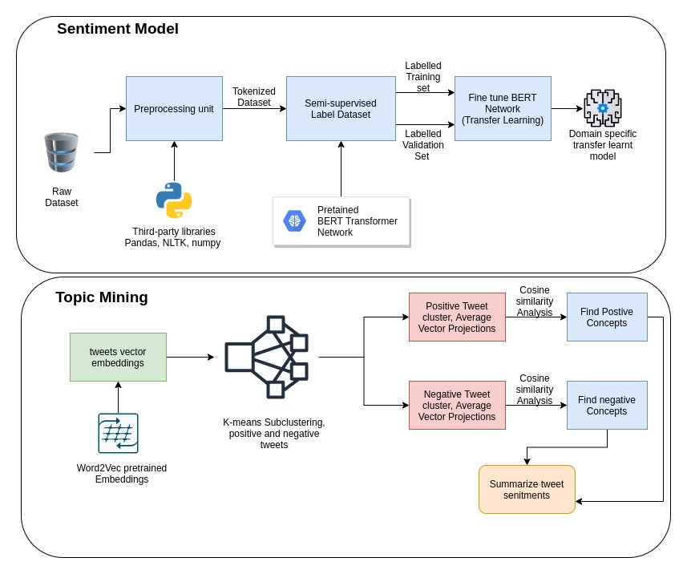
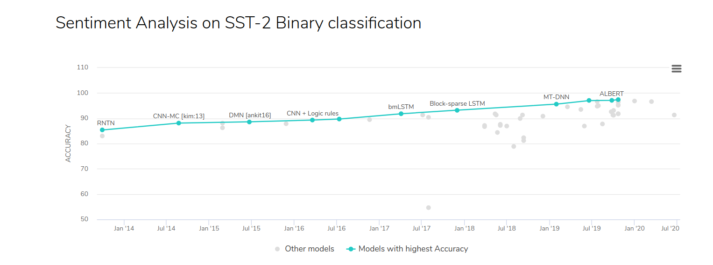
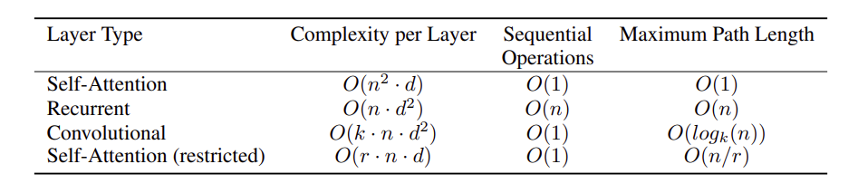

# Senitments-Mining
A semi-supervised BERT based Sentiment classification model and Sentiment cluster mining model.

### Semi-supervised_tweet.ipynb : 
* Cleans the dataset, tokenizes it and loads a pretrained BERT sentiment classification model to generate labels for the unlabelled tweets.
* Generates the training and validation set with labels.
### Transfer-Learn-BERT.ipynb : 
* Loads the labelled dataset and fine-tunes the BERT sentiment model to our specific domain and target variables.
* The trained model achieves test accuracy of `92.48%` with 2 epochs of training(can be improved with further training and hyperparameter tuning).
* Stores the transfer-learnt model.
### Topic-Analysis.ipynb : 
* Loads the labelled dataset, splits the dataset into positive and negative tweets, generates word2vec based wordembeddings using pretrained `GoogleNews-vectors-negative300` embeddings.
* The positive and negative tweets words embeddings used to create sub-clusters.
* Average vector representation of tweets generated per cluster
* Cosine similarity analysis of each tweet with the cluster's centriod.
* Top 99 percentile cosine similarity tweets per cluster are filtered and are analyzed for topic correlation.
* Each cluster is assigned a topic. 

 
